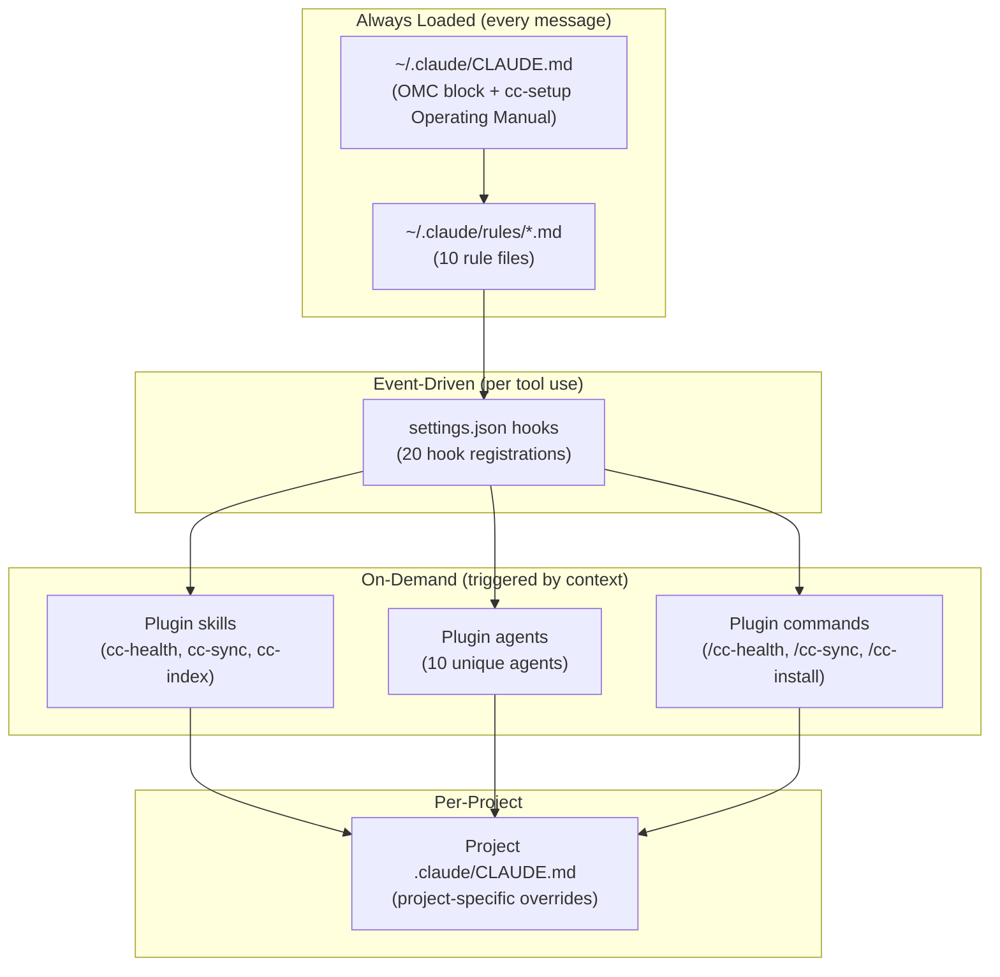
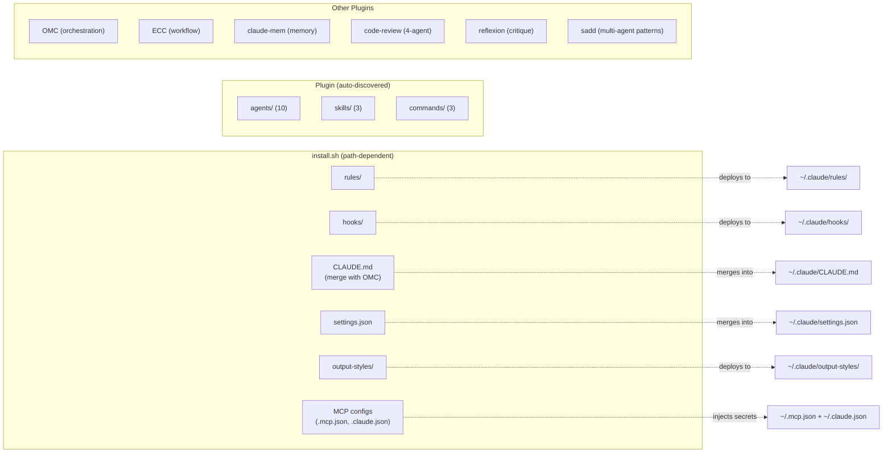

# cc-setup System Architecture

## Context Hierarchy



## Delivery Boundary



## Component Inventory

### cc-setup Plugin (auto-discovered)

| Type | Count | Items |
|------|-------|-------|
| Agents | 10 | brainstormer, docs-manager, fullstack-developer, git-manager, journal-writer, mcp-manager, project-manager, researcher, tester, ui-ux-designer |
| Skills | 3 | cc-health, cc-sync, cc-index |
| Commands | 3 | /cc-health, /cc-sync, /cc-install |

### install.sh (path-dependent config)

| Type | Count | Why not plugin? |
|------|-------|----------------|
| Rules | 10 | Always-loaded context; not a plugin component type |
| Hooks | 20 reg | `__dirname` traversals to `~/.claude/`; path-dependent |
| CLAUDE.md | 1 | OMC ownership; always-loaded; needs merge logic |
| settings.json | 1 | Secret injection + hook registrations |
| output-styles | 6 | Not a plugin component type |
| MCP configs | 2 | Secret injection required |

### Removed Agents (15 — covered by OMC/ECC)

architect, build-error-resolver, code-reviewer, code-simplifier, database-reviewer, debugger, doc-updater, e2e-runner, go-build-resolver, go-reviewer, planner, python-reviewer, refactor-cleaner, security-reviewer, tdd-guide

### Removed Plugins (3 — redundant)

| Plugin | Reason |
|--------|--------|
| skills-search@daymade-skills | Subsumed by claude-skills-troubleshooting (42 > 38 skills) |
| start@the-startup | 15 skills all covered by OMC + ECC |
| kaizen@context-engineering-kit | Methodology absorbed by OMC ralplan + ralph |

## Enforcement Chain

| Principle | Rule File | Hook Enforcement | Skill Backup |
|-----------|-----------|-----------------|-------------|
| No mocks/stubs | philosophy.md | block-test-files.js (PreToolUse:Write\|Edit) | functional-validation |
| Check skills first | workflow.md | skill-activation-forced-eval.js (UserPromptSubmit) | — |
| Evidence before done | workflow.md | evidence-gate-reminder.js (PreToolUse:TaskUpdate) | gate-validation-discipline |
| Plan before code | workflow.md | plan-before-execute.js (PreToolUse:Write\|Edit) | — |
| Read before edit | philosophy.md | read-before-edit.js (PreToolUse:Edit) | — |
| Context in subagents | orchestration.md | subagent-context-enforcer.js (PreToolUse:Agent) | — |

## Secret Flow

```
.env.template → .env (user fills in) → inject_secrets() → ~/.mcp.json + ~/.claude.json
                                                            (4 API keys injected at deploy time)
```

Keys: GITHUB_PERSONAL_ACCESS_TOKEN, FIRECRAWL_API_KEY, CONTEXT7_API_KEY, GOOGLE_API_KEY
