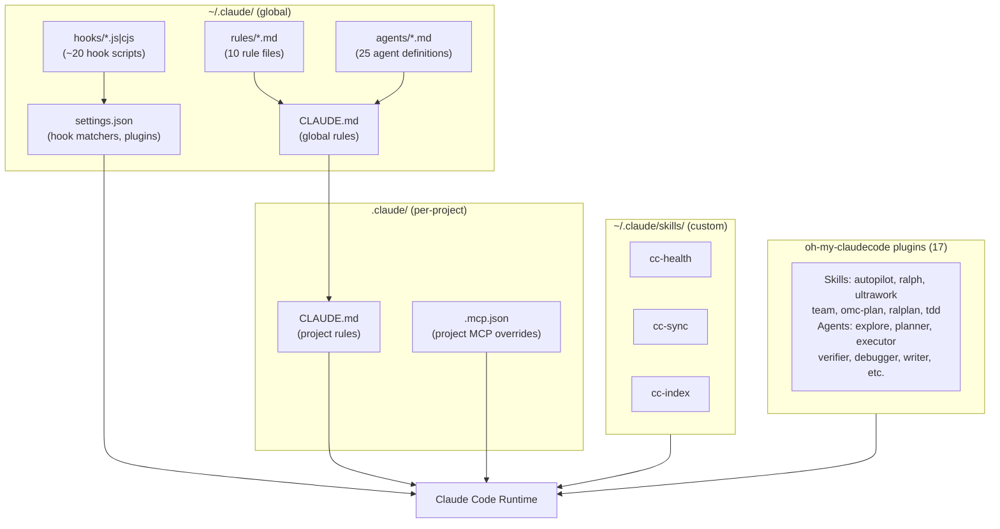
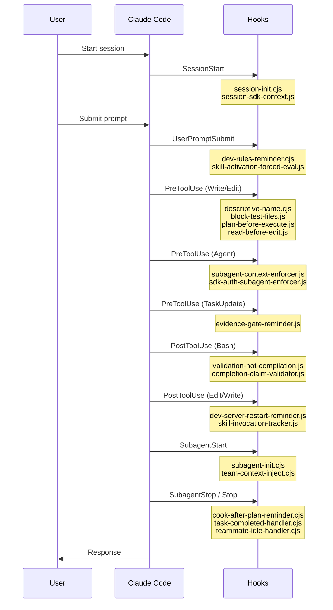
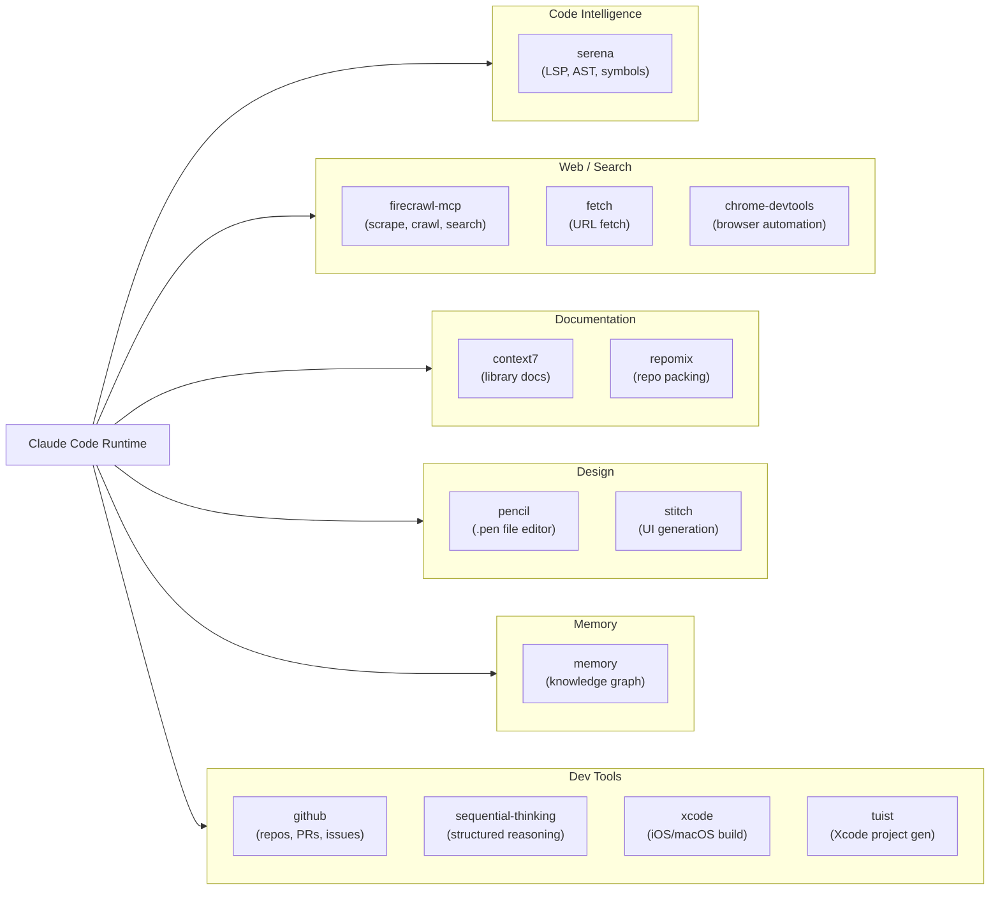
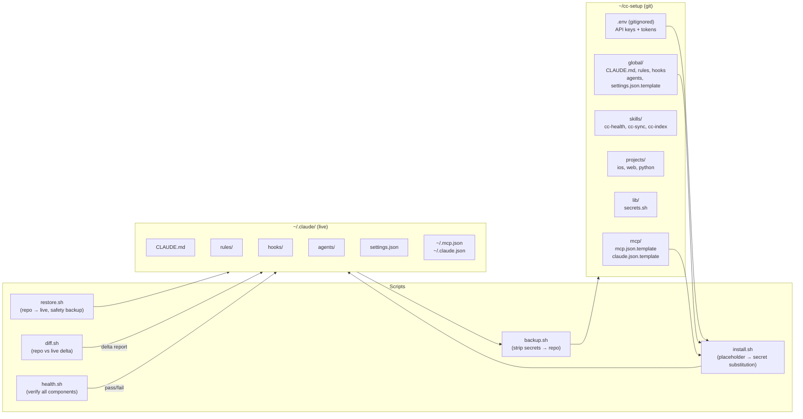

# System Diagram

## Context Inheritance Flow

```mermaid
flowchart TD
    subgraph Global["~/.claude/ (global)"]
        GCM["CLAUDE.md\n(global rules)"]
        GR["rules/*.md\n(10 rule files)"]
        GA["agents/*.md\n(25 agent definitions)"]
        GH["hooks/*.js|cjs\n(~20 hook scripts)"]
        GS["settings.json\n(hook matchers, plugins)"]
    end

    subgraph Project[".claude/ (per-project)"]
        PCM["CLAUDE.md\n(project rules)"]
        PM[".mcp.json\n(project MCP overrides)"]
    end

    subgraph Skills["~/.claude/skills/ (custom)"]
        SH["cc-health"]
        SS["cc-sync"]
        SI["cc-index"]
    end

    subgraph Plugins["oh-my-claudecode plugins (17)"]
        OMC["Skills: autopilot, ralph, ultrawork\nteam, omc-plan, ralplan, tdd\nAgents: explore, planner, executor\nverifier, debugger, writer, etc."]
    end

    GCM --> PCM
    GR --> GCM
    GA --> GCM
    GH --> GS
    GS --> CC["Claude Code Runtime"]
    PCM --> CC
    PM --> CC
    Skills --> CC
    Plugins --> CC
```

## Hook Lifecycle

```mermaid
sequenceDiagram
    participant U as User
    participant CC as Claude Code
    participant H as Hooks

    U->>CC: Start session
    CC->>H: SessionStart
    Note over H: session-init.cjs<br/>session-sdk-context.js

    U->>CC: Submit prompt
    CC->>H: UserPromptSubmit
    Note over H: dev-rules-reminder.cjs<br/>skill-activation-forced-eval.js

    CC->>H: PreToolUse (Write/Edit)
    Note over H: descriptive-name.cjs<br/>block-test-files.js<br/>plan-before-execute.js<br/>read-before-edit.js

    CC->>H: PreToolUse (Agent)
    Note over H: subagent-context-enforcer.js<br/>sdk-auth-subagent-enforcer.js

    CC->>H: PreToolUse (TaskUpdate)
    Note over H: evidence-gate-reminder.js

    CC->>H: PostToolUse (Bash)
    Note over H: validation-not-compilation.js<br/>completion-claim-validator.js

    CC->>H: PostToolUse (Edit/Write)
    Note over H: dev-server-restart-reminder.js<br/>skill-invocation-tracker.js

    CC->>H: SubagentStart
    Note over H: subagent-init.cjs<br/>team-context-inject.cjs

    CC->>H: SubagentStop / Stop
    Note over H: cook-after-plan-reminder.cjs<br/>task-completed-handler.cjs<br/>teammate-idle-handler.cjs

    CC->>U: Response
```

## MCP Server Topology

```mermaid
graph LR
    CC["Claude Code Runtime"]

    subgraph CI["Code Intelligence"]
        serena["serena\n(LSP, AST, symbols)"]
    end

    subgraph Web["Web / Search"]
        firecrawl["firecrawl-mcp\n(scrape, crawl, search)"]
        fetch["fetch\n(URL fetch)"]
        chrome["chrome-devtools\n(browser automation)"]
    end

    subgraph Docs["Documentation"]
        context7["context7\n(library docs)"]
        repomix["repomix\n(repo packing)"]
    end

    subgraph Design["Design"]
        pencil["pencil\n(.pen file editor)"]
        stitch["stitch\n(UI generation)"]
    end

    subgraph Mem["Memory"]
        memory["memory\n(knowledge graph)"]
    end

    subgraph Dev["Dev Tools"]
        github["github\n(repos, PRs, issues)"]
        seqthink["sequential-thinking\n(structured reasoning)"]
        xcode["xcode\n(iOS/macOS build)"]
        tuist["tuist\n(Xcode project gen)"]
    end

    CC --> CI
    CC --> Web
    CC --> Docs
    CC --> Design
    CC --> Mem
    CC --> Dev
```

## Deploy Pipeline

```mermaid
flowchart LR
    subgraph Repo["~/cc-setup (git)"]
        direction TB
        G["global/\nCLAUDE.md, rules, hooks\nagents, settings.json.template"]
        M["mcp/\nmcp.json.template\nclaude.json.template"]
        SK["skills/\ncc-health, cc-sync, cc-index"]
        PR["projects/\nios, web, python"]
        LB["lib/\nsecrets.sh"]
        ENV[".env (gitignored)\nAPI keys + tokens"]
    end

    subgraph Scripts["Scripts"]
        IS["install.sh\n(placeholder → secret substitution)"]
        BK["backup.sh\n(strip secrets → repo)"]
        RS["restore.sh\n(repo → live, safety backup)"]
        DF["diff.sh\n(repo vs live delta)"]
        HL["health.sh\n(verify all components)"]
    end

    subgraph Live["~/.claude/ (live)"]
        direction TB
        LC["CLAUDE.md"]
        LR["rules/"]
        LH["hooks/"]
        LA["agents/"]
        LS["settings.json"]
        LM["~/.mcp.json\n~/.claude.json"]
    end

    ENV --> IS
    G --> IS
    M --> IS
    IS --> Live
    Live --> BK
    BK --> Repo
    RS --> Live
    DF --> |"delta report"| Live
    HL --> |"pass/fail"| Live
```
